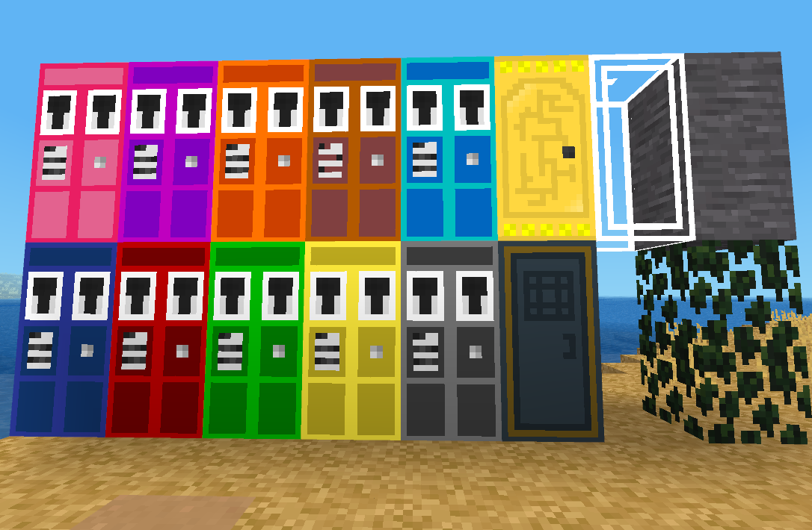

# Tardis
A mod inspired by [Taridis_New](https://github.com/PiDemon/Taridis_New), using extra features and complete redesign from ground up.

## Todo:

> Last Updated: 01/20/2022

- [x] Build Mod Storage Structure
- [ ] Build more sophisticated placement of tardis interior schematic (Focus on more better placement coding)
- [X] Support Tardis_New's Exterior textures (Also complete the color choices)
- [ ] Add support for Interior Dark/Light Theming (Just to add extra decor choices)
- [ ] Merge X/Y/Z Consoles into one Navigation Console
- [ ] Support Dematerialized state (There is no exit, there for the tardis seals the door, but allows essentially no access (Unless someone knows the interior pos)
- [ ] Rework Re-materialization to call a load_map routine so the tardis can be used for exploration (Thank you voxel manip)
- [ ] Support more advanced healing and even support passive repairing of tools (detect if technic is installed and then charge power tools too)
- [ ] Redesign Taridis_New's Rotor to support greater than 10 power, and manage power generation/power consumption (I.E. Passive heal and Passive repair/recharge cost power)
- [X] Change `member` to `companion` in memberships (More timey wimey)
- [ ] Allow manual or even auto placement of exterior facing direction (Auto placement would check the exit direction to verify we are clear to spawn there, if not keep rotating till we find a direction that is clear)\*
- [X] Fix collision boxes for lights (they currently eat the whole node, not allowing the player to walk thru them/next to them)
- [ ] Fix `tardis:door` so it properly places the user on the correct side the tardis is facing (as if they properly exited the tardis, rather than 1 direction support hell)
- [X] Make punchable lights (toggle lights by punching)
- [ ] Make a "light switch" to toggle all lights inside a Tardis on or off based on it's state. (turning off/on any new lights that were placed)
- [ ] Complete redesign of how nodes are created, and get out of shortened filenames so they are better described.

\* The changing of facing direction won't change the interior, just the exterior would face a particular direction. (This will need to be recorded in waypoints too)

## Future:

> These plans may not ever occur, but are written down so if someone else wanted to help contribute (fan art, what not) feel free.

* K9 (As entity, when entering the Tardis it greets it's owner, fires a laser bolt from his nose just like in the show)
* Cloister Bell (Possibly to indicate Tardis damage, and possibly even low power, possibly include it making that sound when unable to leave for many reasons)
